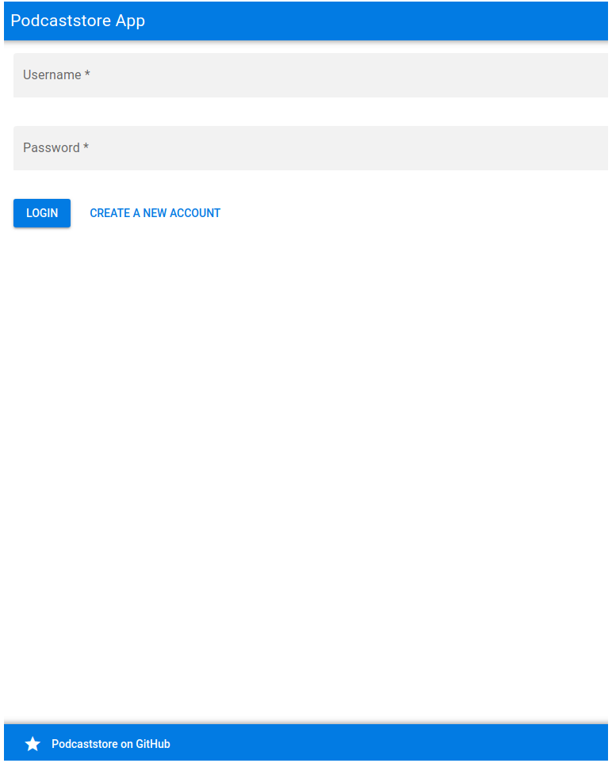

# podcaststore-vuejs

Podcaststore App front-end in Vue.js

## Demo

You can check a demo running on my VPS [on this URL](http://podcaststore.devdaily.org:8080/). It's running over HTTP instead of HTTPs to simplify the deployment.

## Screenshot



## Back-end

You can find the back-end written in Python/Django [here](https://github.com/viniarck/podcaststore-django).

## Project setup
```
yarn install
```

### Compiles and hot-reloads for development
```
yarn run serve
```
